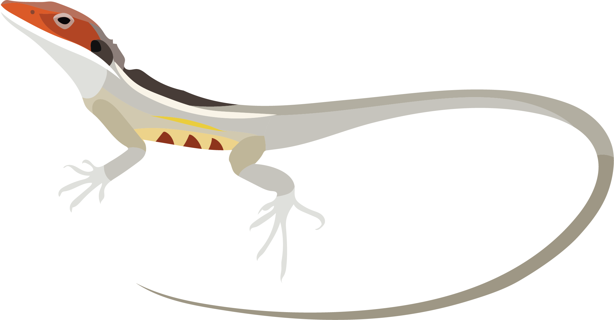

# Figure Critters

*Figure Critters — Making scientific visuals accessible and engaging*

A loosely-curated collection of animal illustrations. The critters are organized by taxonomic group, designed for use in scientific presentations, academic papers, figures, and educational materials.

## Contents

The repository contains categorized image collections:

- **Reptiles** — various reptile species across families
- **Mammals** — mammalian species
- **Amphibians** — amphibian species
- ...

## File Naming Convention

All images follow the naming convention: `Family_Genus_species.png`

For example: `Varanidae_Varanus_komodoensis.png` (Komodo dragon)

This structure makes it easy to identify the taxonomic classification and locate specific organisms quickly.

## License

These images are provided under the [Creative Commons Attribution-NonCommercial (CC-BY-NC) license](https://creativecommons.org/licenses/by-nc/4.0/). 

**Summary:** You are free to share and adapt these images for non-commercial purposes, provided that you give appropriate credit. Commercial use is not permitted without permission.

## Contributing

If you'd like to contribute additional images to this collection, please open an issue, place a pull request, or contact me.

---

